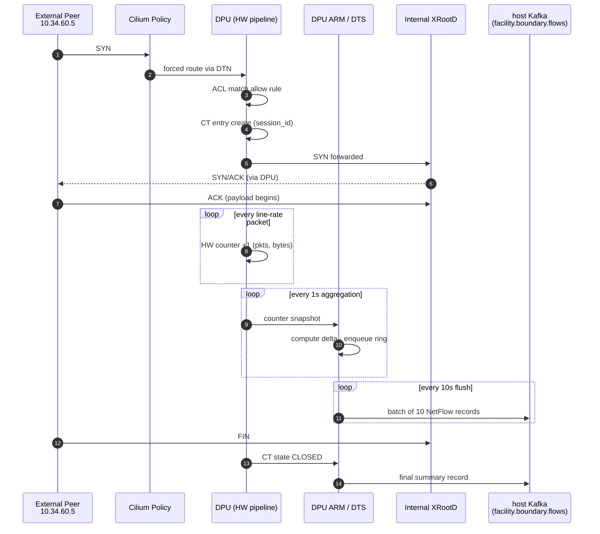

# Boundary Security 시나리오 — XRootD 전송 하나의 생애

## 목적

- DTN(DPU)이 facility 경계에서 **실제로 무엇을 수집하고, 클러스터가 그 정보로 어떤 보안 목적을 달성하는지**를 시간축 기반으로 정리
- 연구 draft의 Security pillar claim을 **구체적 transfer 예시 하나**로 end-to-end 추적
- `applications/telemetry/overview.md`의 5 레이어 수집물이 실제로 어떻게 연결되는지 보여주는 사례

---

## 시나리오 설정

### 등장 인물

| 역할 | 주소 / 자원 |
|------|-----------|
| External peer (같은 캠퍼스 내 다른 lab) | `10.34.60.5:32451` |
| Facility DTN (boundary node) | `10.34.20.4` — tempnode-bf3 역할 |
| 내부 XRootD 서버 Pod | `10.244.1.23:1094` (cluster internal) |
| 대상 dataset | `/atlas/run2/D123.root` (2.1 GB) |

### 사전 설정 (CRD로 미리 선언된 정책)

```yaml
apiVersion: security.datafacility.io/v1
kind: BoundaryPolicy
metadata:
  name: xrootd-allow-from-lab-b
spec:
  match:
    srcCIDR: 10.34.60.0/24
    dstPort: 1094
    protocol: TCP
  action: allow
  rateLimit: 20Gbps
```

- Cilium 설정
  - `CiliumEgressGatewayPolicy` — 내부 pod → 외부 egress 경로 DTN SNAT 강제
  - `CiliumL2AnnouncementPolicy` — LB IP 광고를 DTN에서만 (외부 ingress 유입 지점 독점)
- DPF가 이미 DTN에 DPU 관리 · DTS DPUService 배포 완료

---

## Timeline — transfer 한 건의 생애

### 연결 확립 (T = 0.000 ~ 0.010s)

| 시점 | 이벤트 | DPU 관찰 기록 |
|------|-------|-------------|
| `0.000s` | peer가 SYN 송신 · Cilium이 DTN으로 강제 경유 | — |
| `0.001s` | DPU `doca_flow` ACL pipe가 5-tuple 검사 | `counter(xrootd-allow-from-lab-b).hits += 1` |
| `0.002s` | Connection Tracking entry 생성 · `session_id = 0x7f3a9c4b2e...` 할당 | `CT{flow_id, 5-tuple, state=SYN_SENT}` |
| `0.003 ~ 0.010s` | 3-way handshake 완료 · CT state `ESTABLISHED` | `Δ pkts=3, Δ bytes=180` |

### 데이터 전송 (T = 0.5 ~ 181.5s)

| 시점 | 이벤트 | DPU 관찰 기록 |
|------|-------|-------------|
| `0.5s ~` | XRootD 인증 완료 · payload 흐름 시작 | 매 패킷 HW counter `+1` (line-rate) |
| `1.0s` | DTS 1st aggregation cycle (`update: 1000ms`) | Δ pkts=8,123 · Δ bytes=12.1 MB · rate=97 Mbps |
| `1.0s ~ 180s` | 매초 delta 레코드 ring buffer에 enqueue | |
| `10s 주기` | `sync-time-limit` 만료 · flush → Kafka에 batch 송신 | 10개 레코드/batch |
| `181.5s` | FIN · CT state `TIME_WAIT → CLOSED` | 최종 summary record 생성 |

### 최종 NetFlow v9 레코드 (DPU → host Kafka)

```
src_addr       : 10.34.60.5
dst_addr       : 10.34.20.4
src_port       : 32451
dst_port       : 1094
protocol       : 6 (TCP)
tcp_flags      : 0x1F (SYN|ACK|PSH|FIN cumulative)
in_pkts        : 1,487,203
in_bytes       : 2,187,540,210
first_switched : 1712345600 (T=0)
last_switched  : 1712345782 (T=182)
session_id     : 0x7f3a9c4b2e1d08a7
app_name       : "XRootD"
```

→ 이 레코드 1개가 전송 하나를 **완전히 요약**. 이후 모든 보안 활용은 이 레코드(+ 시계열 snapshot) 위에서 일어남.

---

## 시퀀스 다이어그램



---

## 클러스터는 이 수집물을 어떻게 활용하나 — 4갈래

**같은 수집물**(DPU가 만든 flow metric / NetFlow 레코드)이 **4개 채널**로 동시 흐름.

### 1. 실시간 차단 (Enforcement) — ACL plane

- 시점 `T = 0.001s` (첫 패킷)
- 메커니즘
  - 정책 일치 → `forward`
  - 정책 불일치 → **DPU가 HW에서 즉시 drop**. host touch 0
- 보안 목적: **bypass-proof 접근 제어**

**반례 시나리오** — 허용 안 된 peer (`10.34.90.x`)의 SYN
```
T=0.001s  ACL deny → HW drop
          counter(default-deny).hits += 1
T=10s     DTS가 drop counter 집계 → Kafka 전송
T=30s     Alertmanager가 drop rate > threshold 감지 → 알림
```

### 2. 실시간 속도 제한 (Meter) — Enforcement plane

- 시점: 전송 지속 중
- 메커니즘: 정책 `rate ≤ 20 Gbps` · DPU meter가 초과분 자동 drop/mark
- 보안 목적: **DoS · 점유 공격 방어**

**반례 시나리오** — peer가 갑자기 50 Gbps burst
```
DPU meter: 20 Gbps 초과 packets → mark=drop
counter(rate-exceed).bytes += [초과량]
```

### 3. 준실시간 이상 탐지 (Anomaly detection) — Observer plane

- 시점: 분 단위 scoring
- 메커니즘: Kafka → Prometheus 시계열 → rule/ML로 평가
- 보안 목적: **정상 트래픽 속 비정상 패턴 포착**

**예시 Prometheus 규칙** — 평소 24h 평균 대비 10배 폭증
```promql
rate(facility_egress_bytes_total{peer="10.34.60.5"}[5m])
  > 10 * avg_over_time(
      rate(facility_egress_bytes_total{peer="10.34.60.5"}[5m])[24h:5m]
    )
```

반응
- Grafana red alert
- Alertmanager → Slack / PagerDuty
- (선택) 자동 대응 — CRD 조작해 해당 peer rate limit 임시 하향

### 4. 사후 감사 (Audit correctness) — Observer plane

- 시점: 사건 조사 (수시간 ~ 수일 후)
- 메커니즘: Kafka → long-term storage (Elasticsearch · S3) · SQL/DSL 쿼리
- 보안 목적: **ground truth 재구성** — 애플리케이션 로그 조작·누락 상황에서도 경계 flow 장부는 남아 있음

**예시 Elasticsearch / SQL 쿼리**
```sql
SELECT session_id, src_addr, dst_port, in_bytes, first_switched
FROM facility_boundary_flows
WHERE first_switched BETWEEN '2026-04-18 14:00' AND '2026-04-18 15:00'
  AND dst_port = 1094
ORDER BY in_bytes DESC LIMIT 100;
```

→ 이 기간 XRootD flow **완전한 장부** 획득.

---

## DPU 혼자로는 부족한 지점 — Cross-system join

DPU가 아는 것
- `session_id`, 5-tuple, 볼륨, 시간, 에러, app_name (port 추정)

DPU가 **모르는** 것
- 사용자 (Grid 인증서, proxy DN)
- dataset 이름
- 프로젝트 정당성

### 조인 파이프라인

```
DPU NetFlow  (Kafka topic: facility.boundary.flows)
    key: {session_id, 5-tuple, timestamp}

Rucio transfer log  (Kafka topic: rucio.transfers)
    key: {rucio_rse_session_id, dataset, user_dn, timestamp}

        ↓  Flink/Spark stream join
        ↓  on (timestamp 범위 + IP 매칭 + session_id 매칭 가능 시)

Enriched audit record  (Elasticsearch index: facility.audit)
    {user=alice, dataset=D123, bytes=2GB, peer=lab-B,
     via=DTN, drop=0, policy=xrootd-allow-from-lab-b}
```

**역할 분담**
- DPU = 사실의 뼈대 (flow-level, 위변조 불가, 누락 없음)
- 애플리케이션 layer (Rucio · XRootD log) = 의미의 살 (user · dataset · 정당성)
- 조인 → 완전한 보안 가시성

---

## 연구 draft claim 과의 매핑

| Claim | 이 시나리오에서의 증거 |
|-------|------------------|
| bypass-proof 경계 | 모든 패킷이 Cilium→DTN→DPU 통과 · 우회 경로 0 |
| line-rate 관측 + host CPU 미소모 | HW counter line-rate 누적 · 집계·export 모두 DPU ARM 완결 |
| audit correctness | flow 별 완전한 NetFlow record 생성 · Kafka 영속 저장 |
| cloud-native 관리 | CRD로 정책 선언 · Helm DPUService로 수집 파이프 운영 |
| DPU 단독 = 반쪽 (명시적 non-goal) | user/dataset 의미는 Rucio join 필요 — 한계 명시 |

---

## 핵심 요약

- **한 개 transfer = 한 개 NetFlow record + 수백 개 1초 delta snapshot**
- 이 수집물이 **실시간 차단 · 실시간 meter · 준실시간 anomaly · 사후 audit** 4개 채널로 동시에 흐름
- DPU는 **"네트워크 경계의 정직한 장부"** — ground truth 제공
- 완전한 가시성은 **Rucio / 애플리케이션 로그와 조인**해야 달성됨

## 관련 문서

- [`../fully-cloud-native-data-facility-research-draft.md`](../fully-cloud-native-data-facility-research-draft.md) — 연구 draft 전체 (Security pillar 섹션)
- [`../../applications/telemetry/overview.md`](../../applications/telemetry/overview.md) — DPU가 수집 가능한 정보 5 레이어 상세
- [`../../../projects/flow_common.h`](../../../projects/flow_common.h) — 프로젝트의 counter resource 정의
- [`../../../applications/common/telemetry_exporter.c`](../../../applications/common/telemetry_exporter.c) — 프로젝트 NetFlow ring buffer 구현 참고
