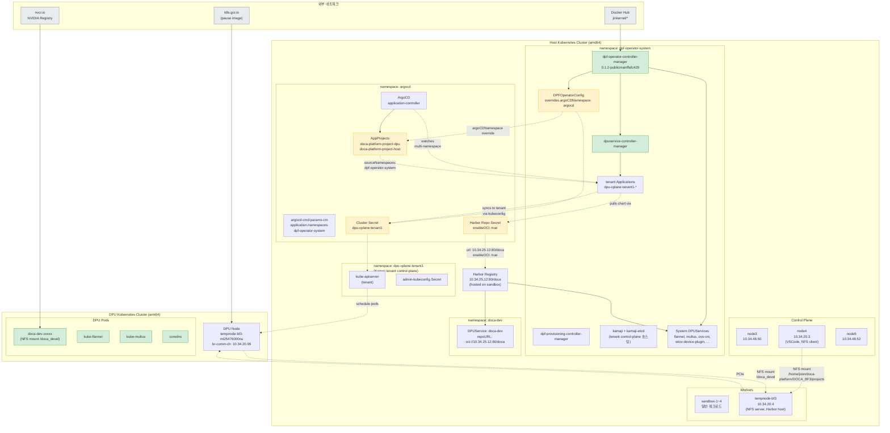
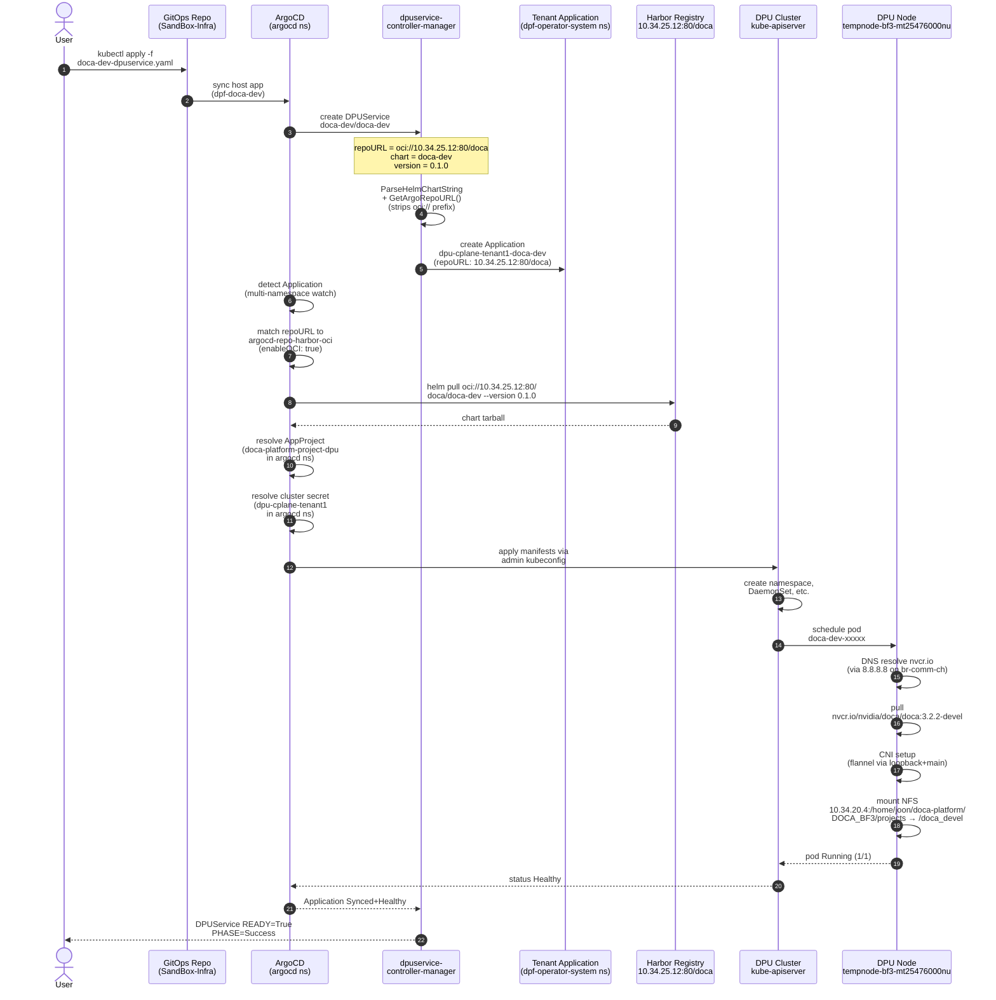
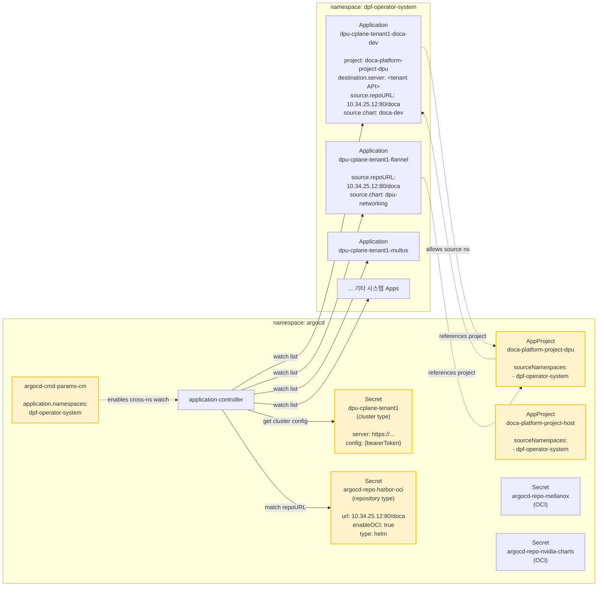
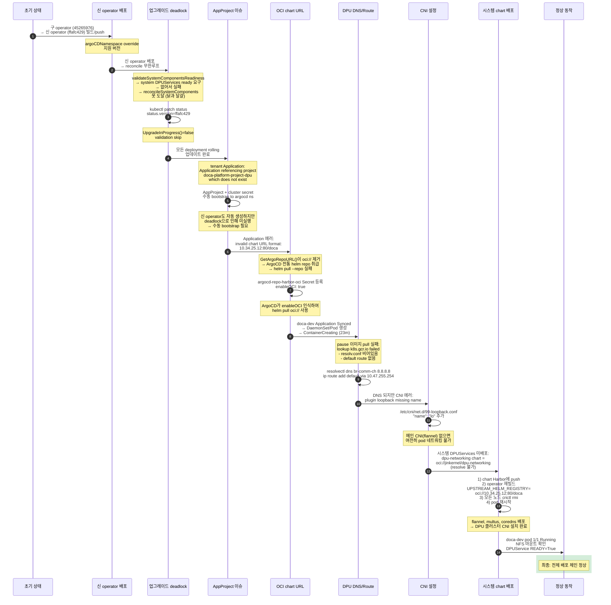
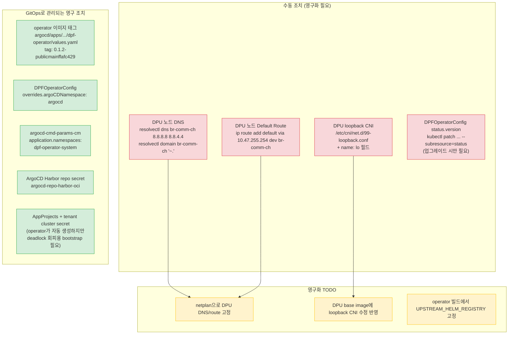
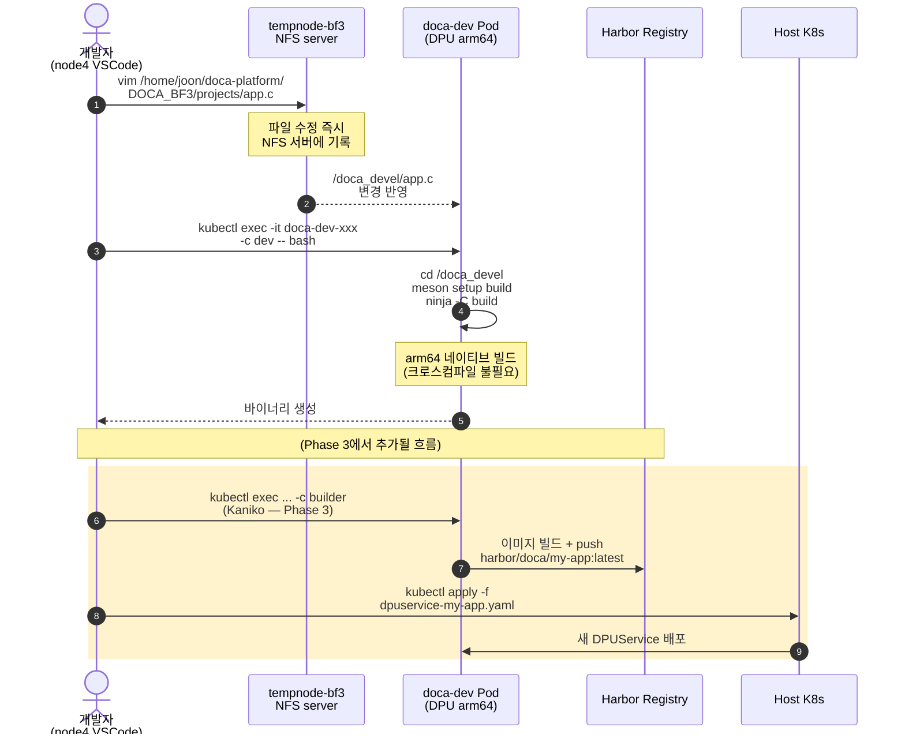

# DPF 현재 클러스터 로직 다이어그램

현재 Sandbox 클러스터(`doca-platform`)에 실제로 동작 중인 DPF의 모든 구성요소와 데이터 흐름을 시각화한 문서.

---

## 1. 전체 아키텍처 (물리 + 논리)

BF3 DPU가 장착된 `tempnode-bf3` 노드와 DPU 위에 Kamaji tenant 클러스터가 동작하는 구조.

---

## 2. DPUService → DPU Pod 배포 시퀀스

사용자가 DPUService YAML을 작성한 시점부터 DPU 노드에서 Pod가 실행되기까지의 전체 흐름.

---

## 3. ArgoCD Multi-Namespace + AppProject Topology

DPF 공식 설계에서 가장 혼동되기 쉬운 부분. Application은 `dpf-operator-system`에, AppProject/Cluster Secret은 `argocd` ns에 있어야 정상 동작.

**주의 사항:**
- `AppProject`와 `Cluster Secret`은 반드시 `argocd` ns에 존재해야 함 (ArgoCD는 자신의 ns에서만 이 리소스 조회)
- `application.namespaces`로 다른 ns의 Application을 watch 허용
- `AppProject.sourceNamespaces`로 해당 ns의 Application이 이 project를 사용하도록 허용
- Harbor repo secret `url`은 `oci://` prefix 없이 저장 (`GetArgoRepoURL()`이 strip하므로 Application의 repoURL과 일치시키기 위함)

---

## 4. Helm Chart 및 Image 빌드/배포 흐름

operator가 참조하는 chart 주소가 어떻게 결정되는지, 왜 재빌드가 필요했는지 설명.

```mermaid
flowchart LR
    subgraph BUILD["빌드 서버 (10.30.0.184)"]
        TMPL["internal/release/templates/<br/>defaults.yaml.tmpl<br/><br/>dpuNetworkingHelmChart:<br/>${UPSTREAM_HELM_REGISTRY}/<br/>${DPU_NETWORKING_HELM_CHART_NAME}<br/>:${TAG}"]
        ENV["make variables<br/>REGISTRY=jinkernel<br/>UPSTREAM_HELM_REGISTRY=<br/>oci://10.34.25.12:80/doca<br/>TAG=0.1.2-publicmainffafc429"]
        ENVSUBST["envsubst"]
        DEFYAML["build/defaults.yaml<br/><br/>dpuNetworkingHelmChart:<br/>oci://10.34.25.12:80/doca/<br/>dpu-networking:TAG"]
        DOCKER["docker buildx build<br/>--no-cache<br/>-f Dockerfile.dpf-system"]
        IMG["Docker Image<br/>jinkernel/dpf-system:TAG<br/><br/>/etc/dpf-defaults.yaml<br/>baked into binary"]
        CHART_PKG["helm package<br/>hack/charts/<br/>dpu-networking-TAG.tgz"]
    end

    subgraph REGISTRIES["Registries"]
        DHUB["Docker Hub<br/>jinkernel/dpf-system:TAG"]
        HARBOR_IMG["Harbor<br/>10.34.25.12:80/doca/<br/>dpu-networking:TAG<br/>doca-dev:0.1.0"]
    end

    subgraph CLUSTER["Host Cluster"]
        NODES["Worker Nodes<br/>crictl image cache"]
        OP_POD["dpf-operator-<br/>controller-manager<br/>(pulls + reads defaults.yaml)"]
        RECONCILE["reconcileSystemComponents"]
        DPUS_OBJ["DPUService objects<br/>with repoURL +<br/>chart + version"]
        ARGO_APP["ArgoCD Application<br/>pulls from Harbor"]
    end

    TMPL --> ENVSUBST
    ENV --> ENVSUBST
    ENVSUBST --> DEFYAML
    DEFYAML -->|COPY build/defaults.yaml<br/>/etc/dpf-defaults.yaml| DOCKER
    DOCKER --> IMG
    IMG -->|docker push| DHUB
    CHART_PKG -->|helm push --plain-http| HARBOR_IMG
    DHUB -->|kubelet pull| NODES
    NODES --> OP_POD
    OP_POD --> RECONCILE
    RECONCILE -->|ParseHelmChartString| DPUS_OBJ
    DPUS_OBJ --> ARGO_APP
    ARGO_APP -->|helm pull oci://| HARBOR_IMG

    classDef crit fill:#f8d7da,stroke:#dc3545
    classDef key fill:#fff3cd,stroke:#ffc107
    class ENV,DEFYAML,CHART_PKG key
    class DOCKER crit
```

**핵심 포인트:**
- `build/defaults.yaml`을 직접 수정해도 소용없음 — `make`가 템플릿에서 재생성
- `UPSTREAM_HELM_REGISTRY`를 make 변수로 반드시 전달
- 같은 태그로 re-push할 때 `imagePullPolicy: IfNotPresent` + 노드 캐시 조합으로 새 이미지 미반영 → 모든 노드에서 `crictl rmi` 필수
- Docker buildx 캐시로 인해 `--no-cache` 필요

---

## 5. 실제로 해결한 문제 체인 (시간 순)

DPF 초기 상태 → 현재 정상 동작까지 겪은 모든 deadlock과 해결 순서.

---

## 6. 현재 활성화된 수동 조치 (재부팅 시 손실)

재부팅이나 재배포 시 다시 적용해야 하는 수동 조치들 — 영구화 필요.

---

## 7. doca-dev 개발 사이클 (현재 동작 상태)

Phase 2 완료 기준 — 사용자가 실제로 할 수 있는 개발 워크플로우.

---

## 참고 문서

- [Phase 0 — Harbor Registry](../dpf-guides/phases/phase0-harbor.md)
- [Phase 1 — NFS Mount](../dpf-guides/phases/phase1-nfs.md)
- [Phase 2 — doca-dev DPUService](../dpf-guides/phases/phase2-doca-dev.md)
- [DPF Cloud-Native Dev Cycle](../dpf-guides/cloud-native-dev.md)
- [Cluster Overview](./cluster-overview.md)
- [DPF Troubleshooting](../troubleshooting/README.md)
