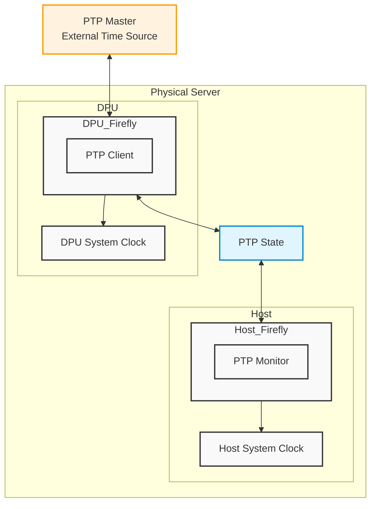

This documentation explains configuration and deployment of DOCA Firefly service as DPUService in DPF.

Main Firefly concepts are explained in the
[official DOCA Firefly documentation](https://docs.nvidia.com/doca/sdk/doca+firefly+service+guide/index.html).  
While the official documentation provides a more comprehensive overview, DPUService users should consult it for detailed
explanation of PTP configuration and monitoring options.

The DOCA Firefly usecase in DPF is mainly to provide PTP time synchronization for the host system clocks.  
We split the service into two components: one **running on the DPU**, which is running the PTP software stack, and the
**other on the host**.

A high-level overview of the **Firefly DPF service architecture** is shown below.



# Service Components

Firefly consists of two main components:

**1. DPU Component**:

    * Runs on the DPU
    * Acts as the PTP client
    * Handles PTP time synchronization
    * Sets DPU system clock

Configuration files:
   
<details markdown="1"><summary>DPUServiceConfiguration-dpu</summary>

[embedmd]:#(../../../../dpuservices/firefly/DPUServiceConfiguration-dpu.yaml)
```yaml
apiVersion: svc.dpu.nvidia.com/v1alpha1
kind: DPUServiceConfiguration
metadata:
  name: firefly-dpu
  namespace: dpf-operator-system
spec:
  deploymentServiceName: firefly-dpu
  interfaces:
    - name: fireflyiface
      network: mybrsfc-firefly
  serviceConfiguration:
    serviceDaemonSet:
      labels:
        svc.dpu.nvidia.com/custom-flows: firefly
    configPorts:
      ports:
        - name: monitor
          port: 25600
          protocol: TCP
      serviceType: ClusterIP
    helmChart:
      values:
        exposedPorts:
          ports:
            monitor: true
        ptpConfig: ptp.conf
        ptpInterfaces: fireflyiface
        config:
          content:
            ptp.conf: |
              [global]
              domainNumber                    24
              clientOnly                      1
              verbose                         1
              logging_level                   6
              dataset_comparison              G.8275.x
              G.8275.defaultDS.localPriority  128
              maxStepsRemoved                 255
              logAnnounceInterval             -3
              logSyncInterval                 -4
              logMinDelayReqInterval          -4
              G.8275.portDS.localPriority     128
              ptp_dst_mac                     01:80:C2:00:00:0E
              network_transport               L2
              fault_reset_interval            1
              hybrid_e2e                      0
  
              [fireflyiface]
```

</details>

<details markdown="1"><summary>DPUServiceTemplate-dpu</summary>

[embedmd]:#(../../../../dpuservices/firefly/DPUServiceTemplate-dpu.yaml)
```yaml
apiVersion: svc.dpu.nvidia.com/v1alpha1
kind: DPUServiceTemplate
metadata:
  name: firefly-dpu
  namespace: dpf-operator-system
spec:
  deploymentServiceName: firefly-dpu
  helmChart:
    source:
      chart: doca-firefly
      repoURL: https://helm.ngc.nvidia.com/nvidia/doca
      version: 1.1.8
    values:
      containerImage: nvcr.io/nvidia/doca/doca_firefly:1.7.4-doca3.2.0
      hostNetwork: false
      enableTXPortTimestampOffloading: true
      monitorState: 0.0.0.0
      phc2sysArgs: -a -r -l 6
      config:
        isLocalPath: false
  resourceRequirements:
    memory: 512Mi
```
</details>

**2. Host Component**:

    * Runs on the host
    * Monitors PTP time synchronization
    * Sets host system clock

Configuration files:

<details markdown="1"><summary>DPUServiceConfiguration-host.yaml</summary>

[embedmd]:#(../../../../dpuservices/firefly/DPUServiceConfiguration-host.yaml)
```yaml
apiVersion: svc.dpu.nvidia.com/v1alpha1
kind: DPUServiceConfiguration
metadata:
  name: firefly-host
  namespace: dpf-operator-system
spec:
  deploymentServiceName: firefly-host
  upgradePolicy:
    applyNodeEffect: false
  serviceConfiguration:
    deployInCluster: true
    helmChart:
      values:
        monitorState: '{{ (index .Services "firefly-dpu").Name }}.{{ (index .Services "firefly-dpu").Namespace }}'
```
</details>

<details markdown="1"><summary>DPUServiceTemplate-host</summary>

[embedmd]:#(../../../../dpuservices/firefly/DPUServiceTemplate-host.yaml)
```yaml
apiVersion: svc.dpu.nvidia.com/v1alpha1
kind: DPUServiceTemplate
metadata:
  name: firefly-host
  namespace: dpf-operator-system
spec:
  deploymentServiceName: firefly-host
  helmChart:
    source:
      chart: doca-firefly
      repoURL: https://helm.ngc.nvidia.com/nvidia/doca
      version: 1.1.8
    values:
      containerImage: nvcr.io/nvidia/doca/doca_firefly:1.7.4-doca3.2.0-host
      hostNetwork: false
      monitorClientPhc2sysInterface: eth0
      monitorClientType: phc2sys
      phc2sysState: disable
      ppsDevice: disable
      ppsState: do_nothing
      ptpState: disable
      tolerations:
        - effect: NoSchedule
          key: k8s.ovn.org/network-unavailable
          operator: Exists
  resourceRequirements:
    memory: 512Mi
```
</details>

The general resources are:

#### DPUFlavor

Defines the DPU flavor for the Firefly service.
<details markdown="1"><summary>DPUFlavor</summary>

[embedmd]:#(../../../../dpuservices/firefly/DPUFlavor.yaml)
```yaml
apiVersion: provisioning.dpu.nvidia.com/v1alpha1
kind: DPUFlavor
metadata:
  annotations:
    provisioning.dpu.nvidia.com/num-of-trusted-sfs: "5"
  name: dpf-provisioning-firefly
  namespace: dpf-operator-system
spec:
  bfcfgParameters:
    - UPDATE_ATF_UEFI=yes
    - UPDATE_DPU_OS=yes
    - WITH_NIC_FW_UPDATE=yes
  configFiles:
    - operation: override
      path: /etc/mellanox/mlnx-bf.conf
      permissions: "0644"
      raw: |
        ALLOW_SHARED_RQ="no"
        IPSEC_FULL_OFFLOAD="no"
        ENABLE_ESWITCH_MULTIPORT="yes"
    - operation: override
      path: /etc/mellanox/mlnx-ovs.conf
      permissions: "0644"
      raw: |
        CREATE_OVS_BRIDGES="no"
        OVS_DOCA="yes"
    - operation: override
      path: /etc/mellanox/mlnx-sf.conf
      permissions: "0644"
      raw: ""
  grub:
    kernelParameters:
      - console=hvc0
      - console=ttyAMA0
      - earlycon=pl011,0x13010000
      - fixrttc
      - net.ifnames=0
      - biosdevname=0
      - iommu.passthrough=1
      - cgroup_no_v1=net_prio,net_cls
      - hugepagesz=2048kB
      - hugepages=3072
  nvconfig:
    - device: '*'
      parameters:
        - PF_BAR2_ENABLE=0
        - PER_PF_NUM_SF=1
        - PF_TOTAL_SF=20
        - PF_SF_BAR_SIZE=10
        - NUM_PF_MSIX_VALID=0
        - PF_NUM_PF_MSIX_VALID=1
        - PF_NUM_PF_MSIX=228
        - INTERNAL_CPU_MODEL=1
        - INTERNAL_CPU_OFFLOAD_ENGINE=0
        - SRIOV_EN=1
        - NUM_OF_VFS=46
        - LAG_RESOURCE_ALLOCATION=1
        - REAL_TIME_CLOCK_ENABLE=1
        - LINK_TYPE_P1=ETH
        - LINK_TYPE_P2=ETH
  ovs:
    rawConfigScript: |
      _ovs-vsctl() {
        ovs-vsctl --no-wait --timeout 15 "$@"
      }

      _ovs-vsctl set Open_vSwitch . other_config:doca-init=true
      _ovs-vsctl set Open_vSwitch . other_config:dpdk-max-memzones=50000
      _ovs-vsctl set Open_vSwitch . other_config:hw-offload=true
      _ovs-vsctl set Open_vSwitch . other_config:pmd-quiet-idle=true
      _ovs-vsctl set Open_vSwitch . other_config:max-idle=20000
      _ovs-vsctl set Open_vSwitch . other_config:max-revalidator=5000
      _ovs-vsctl set Open_vSwitch . other_config:doca-congestion-threshold=60
      _ovs-vsctl set Open_vSwitch . other_config:flow-limit=500000
      _ovs-vsctl set Open_vSwitch . other_config:hw-offload-ct-unidir-udp-enabled=true
      _ovs-vsctl --if-exists del-br ovsbr1
      _ovs-vsctl --if-exists del-br ovsbr2
      _ovs-vsctl --may-exist add-br br-sfc
      _ovs-vsctl set bridge br-sfc datapath_type=netdev
      _ovs-vsctl set bridge br-sfc fail_mode=secure
      _ovs-vsctl --may-exist add-port br-sfc p0
      _ovs-vsctl set Interface p0 type=dpdk
      _ovs-vsctl set Port p0 external_ids:dpf-type=physical

      # Activate DOCA for OVNK
      _ovs-vsctl set Open_vSwitch . external-ids:ovn-bridge-datapath-type=netdev
      # setup ovnkube managed bridge, br-dpu (this corresponds to br-ex on ovnk docs)
      _ovs-vsctl --may-exist add-br br-dpu
      _ovs-vsctl br-set-external-id br-dpu bridge-id br-dpu
      _ovs-vsctl br-set-external-id br-dpu bridge-uplink pbrdputobrovn
      _ovs-vsctl set bridge br-dpu datapath_type=netdev
      _ovs-vsctl --may-exist add-port br-dpu pf0hpf
      _ovs-vsctl set Interface pf0hpf mtu_request=9216
      _ovs-vsctl set Interface pf0hpf type=dpdk

      # Create OVS bridge (br-ovn) in between the SC managed bridge and OVNK
      _ovs-vsctl --may-exist add-br br-ovn
      _ovs-vsctl set bridge br-ovn datapath_type=netdev
      _ovs-vsctl --may-exist add-port br-ovn pbrovntobrdpu
      _ovs-vsctl --may-exist add-port br-dpu pbrdputobrovn

      # Patch br-ovn and br-dpu together
      _ovs-vsctl set Interface pbrovntobrdpu type=patch options:peer=pbrdputobrovn
      _ovs-vsctl set Interface pbrdputobrovn type=patch options:peer=pbrovntobrdpu

      # Disabling DPU NTP. Requires functional PTP setup.
      systemctl disable ntpsec --now
```
</details>

#### DPUServiceNAD

Defines the trusted [Scalable Function (SF)](https://docs.nvidia.com/networking/display/bluefielddpuosv385/scalable+functions)
for the Firefly service.

<details markdown="1"><summary>DPUServiceNAD</summary>

[embedmd]:#(../../../../dpuservices/firefly/DPUServiceNAD.yaml)
```yaml
apiVersion: svc.dpu.nvidia.com/v1alpha1
kind: DPUServiceNAD
metadata:
  name: mybrsfc-firefly
  namespace: dpf-operator-system
  annotations:
    dpuservicenad.svc.dpu.nvidia.com/use-trusted-sfs: ""
spec:
  resourceType: sf
  ipam: false
  bridge: "br-sfc"
  serviceMTU: 1500
```
</details>

#### DPUDeployment

Defines the DPUDeployment for the Firefly service.
<details markdown="1"><summary>DPUDeployment</summary>

[embedmd]:#(../../../../dpuservices/firefly/DPUDeployment.yaml)
```yaml
apiVersion: svc.dpu.nvidia.com/v1alpha1
kind: DPUDeployment
metadata:
  name: ovn-firefly
  namespace: dpf-operator-system
spec:
  dpus:
    bfb: bf-bundle
    dpuSets:
      - nameSuffix: dpuset1
        dpuNodeSelector:
          matchLabels:
            feature.node.kubernetes.io/dpu-enabled: "true"
    flavor: dpf-provisioning-firefly
    nodeEffect:
      drain: true
    dpuSetStrategy:
      type: RollingUpdate
  serviceChains:
    switches:
      - ports:
          - serviceInterface:
              matchLabels:
                uplink: p0
          - serviceInterface:
              matchLabels:
                port: ovn
          - service:
              interface: fireflyiface
              name: firefly-dpu
  services:
    firefly-dpu:
      serviceConfiguration: firefly-dpu
      serviceTemplate: firefly-dpu
    firefly-host:
      serviceConfiguration: firefly-host
      serviceTemplate: firefly-host
      dependsOn:
        - name: firefly-dpu
    ovn:
      serviceConfiguration: ovn
      serviceTemplate: ovn
```
</details>

For information about OVN Kubernetes configuration see the [OVN Kubernetes user guide](../../user-guides/host-trusted/use-cases/ovnk/README.md)

# Configuration

[Official Firefly documentation](https://docs.nvidia.com/doca/sdk/doca+firefly+service+guide/index.html) explains
configuration options.

General note: In the official documentation, all options should be specified in the `ptp.conf` file.  
In DPF the same options should be set via the `DPUServiceConfiguration`.

## Preconfiguration

Our referenced example `DPUServiceConfigration` includes G.8275.1 PTP Profile configuration. You can set all necessary
configurations to your needs.

# Network Configuration

The Firefly service requires a **trusted Scalable Function (SF)** to enable secure PTP communication. This interface is added
to the SFC bridge using a `DPUServiceNAD` (Network Attachment Definition). The `DPUService` controller takes care of
injecting the correct resource to the Pod using that [DPUServiceNAD](#dpuservicenad).

# DPUDeployment

The complete `DPUDeployment` configuration is in [DPUDeployment](#dpudeployment).

# Toleration Configuration

The Firefly service includes a special configuration (toleration) that ensures it always runs on the host system. This
is important because:

1. The service needs to run on the host to properly synchronize the system time.
2. Without proper time synchronization, other system components might not work correctly.
3. The toleration prevents the service from being blocked from running on the host.

This configuration is automatically handled in the DPUServiceTemplate and does not require any user configuration.

# Check the Status

You can check the status of the Firefly service using the following command:

```bash
$ kubectl -n dpf-operator-system exec deploy/dpf-operator-controller-manager -- /dpfctl describe all --grouping=false --show-conditions=dpuservices
NAME                                                        NAMESPACE            STATUS        REASON             SINCE  MESSAGE
DPFOperatorConfig/dpfoperatorconfig                         dpf-operator-system  Ready: Trye   Success            31s
├─DPUClusters
│ └─DPUCluster/dpu-cplane-tenant1                           dpu-cplane-tenant1   Ready: True   HealthCheckPassed  27h
├─DPUDeployments
│ └─DPUDeployment/firefly                                   dpf-operator-system  Ready: True   Success            12m
│   ├─DPUServices
│   │ ├─DPUService/firefly-dpu-v6pbk                        dpf-operator-system
│   │ │             ├─Ready                                                      True          Success            8m24s
│   │ │             ├─ApplicationPrereqsReconciled                               True          Success            3h7m
│   │ │             ├─ApplicationsReady                                          True          Success            8m24s
│   │ │             ├─ApplicationsReconciled                                     True          Success            3h7m
│   │ │             ├─ConfigPortsReconciled                                      True          Success            3h7m
│   │ │             └─DPUServiceInterfaceReconciled                              True          Success            3h7m
│   │ ├─DPUService/firefly-host-jj98d                       dpf-operator-system
│   │ │             ├─Ready                                                      True          Success            4m46s
│   │ │             ├─ApplicationPrereqsReconciled                               True          Success            27h
│   │ │             ├─ApplicationsReady                                          True          Success            4m46s
│   │ │             ├─ApplicationsReconciled                                     True          Success            27h
│   │ │             ├─ConfigPortsReconciled                                      True          Success            27h
│   │ │             └─DPUServiceInterfaceReconciled                              True          Success            27h
...
```
