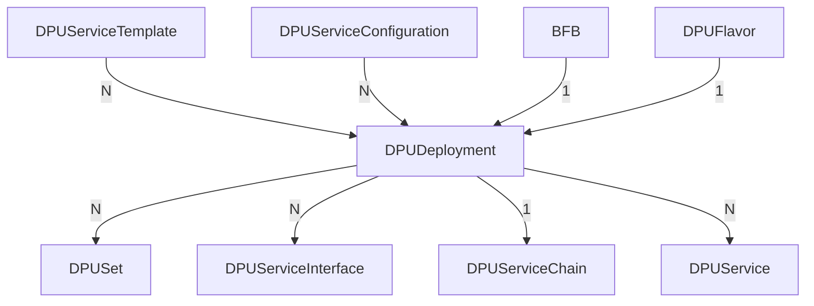

[TOC]

This document describes how a user can work with the `DPUDeployment` Custom Resource.
A `DPUDeployment` describes a set of `DPUServices` and a `DPUServiceChain` that run
on a set of DPUs with a given `BFB` and `DPUFlavor`.



Throughout this document, there are examples for the required Custom Resources that
end up building a valid `DPUDeployment` Custom Resource. These examples contain comments
related to fields that are set for more context. The theoretical example is about
3 services, one of them producing work, another one executing work (producer-consumer
problem) and the last one observing the state.

## Capabilities

* Validates dependencies to ensure that they are configured correctly and reports
  errors in the `DPUDeployment` status conditions accordingly.
* Validates that requested `DPUService` resources fit the DPUs they are targeting
  and report errors in the `DPUDeployment` status conditions accordingly.
* Validates that the version requirements of the `DPUService` fit the versions
  found in the given `BFB` and reports errors in the `DPUDeployment` status conditions
  accordingly.
* Gracefully handles synchronized disruptive and non-disruptive updates of the underlying
  objects.

## Created Child Custom Resources

When applying a valid `DPUDeployment` that has all of its dependencies set correctly
and available, there will be a couple of objects that are going to be created automatically:

* `DPUSet`: Deploys a given `BFB` with configuration provided by the given `DPUFlavor`
  to the target `DPUs`. A `DPUDeployment` may create multiple such objects, depending
  on what is specified in its `spec`.
* `DPUServiceInterface`: Used to construct a Service Chain on the DPU. A `DPUDeployment`
  may create multiple such objects, depending on what is specified in
  the [DPUServiceConfiguration](#dpuserviceconfiguration).
* `DPUServiceChain`: Used to define a Service Chain on the DPU that references the
  interfaces created above. A `DPUDeployment` creates a single `DPUServiceChain`.
* `DPUService`: Deploys a service as Pod in each DPU or in the nodes part of the Host cluster.
  Standard `DPUServices` are deployed on the DPUs, while in-cluster `DPUServices` are deployed
  on the Host cluster nodes. A `DPUDeployment` may create multiple such objects, depending on
  what is specified in its `spec`.

## Prerequisite Custom Resources With Examples

There are several Custom Resources that are required in order to make use of the
`DPUDeployment`. These are:

* [DPUServiceTemplate](#dpuservicetemplate)
* [DPUServiceConfiguration](#dpuserviceconfiguration)
* [DPUFlavor](#dpuflavor)
* [BFB](#bfb)

### DPUServiceTemplate

A `DPUServiceTemplate` contains configuration options related to resources required
by the `DPUService` to be deployed. This Custom Resource is usually provided by NVIDIA
for the supported `DPUServices` that are published. It helps generate the underlying
`DPUService`. It is the base configuration for the `DPUService` that is getting merged
with configuration provided by the `DPUServiceConfiguration`. If there is a conflict,
settings in `DPUServiceConfiguration` take precedence.

A user must create as many `DPUServiceTemplate` Custom Resources as the number of
services they aim to deploy using a `DPUDeployment`. In this example, we will need
to create 3 of those since we have 3 `DPUServices`.

```yaml
---
apiVersion: svc.dpu.nvidia.com/v1alpha1
kind: DPUServiceTemplate
metadata:
  name: producer
  namespace: customer-namespace
spec:
  deploymentServiceName: "producer" # Must match the key in the `dpudeployment.spec.services`
  helmChart:
    source:
      repoURL: https://example.com/charts
      path: producer
      version: v0.0.1
    # The `DPUServiceTemplate` owner should specify requests and limits for the actual containers. The
    # `DPUServiceTemplate` owner is responsible to ensure that those resources are not exceeding the specified
    # `resourceRequirements` field. Notice that setting resources on containers may be different per Helm Chart
    # implementation.
    values:
      container1:
        resources:
          requests:
            cpu: 0.2
            memory: 0.2Gi
            nvidia.com/sf: 1
          limits:
            cpu: 0.4
            memory: 0.4Gi
            nvidia.com/sf: 1
      container2:
        resources:
          limits:
            cpu: 0.6
            memory: 0.6Gi
  # resourceRequirements contains the overall resources required by this particular service to run on a single node
  # This is the field that is considered when scheduling a `DPUDeployment`.
  resourceRequirements:
    cpu: 1
    memory: 1Gi
    nvidia.com/sf: 1
---
apiVersion: svc.dpu.nvidia.com/v1alpha1
kind: DPUServiceTemplate
metadata:
  name: consumer
  namespace: customer-namespace
spec:
  deploymentServiceName: "consumer"
  helmChart:
    source:
      repoURL: https://example.com/charts
      path: consumer
      version: v0.0.1
    values:
      worker:
        parallelization: 5
        resources:
          requests:
            cpu: 1
            memory: 1Gi
            nvidia.com/sf: 1
          limits:
            cpu: 1
            memory: 2Gi
            nvidia.com/sf: 1
  resourceRequirements:
    cpu: 2
    memory: 4Gi
    nvidia.com/sf: 1
---
apiVersion: svc.dpu.nvidia.com/v1alpha1
kind: DPUServiceTemplate
metadata:
  name: observer
  namespace: customer-namespace
spec:
  deploymentServiceName: "observer"
  helmChart:
    source:
      repoURL: https://example.com/charts
      path: observer
      version: v0.0.1
    values:
      observer:
        resources:
          requests:
            cpu: 0.5
            memory: 0.5Gi
          limits:
            cpu: 0.5
            memory: 1Gi
```

### DPUServiceConfiguration

A `DPUServiceConfiguration` contains all configuration options from the user to be
provided to the `DPUService` via the Helm values. This Custom Resource is usually
crafted by the user according to their environment and intended use of the `DPUService`.
It helps generate the underlying `DPUService`. It is a layer on top of the configuration
defined in the `DPUServiceTemplate`. This configuration is getting merged with
configuration provided by the `DPUServiceTemplate`. If there is a conflict, settings
in `DPUServiceConfiguration` take precedence.

A user must create as many `DPUServiceConfiguration` Custom Resources as the number
of services they aim to deploy using a `DPUDeployment`. In this example, we will
need to create 3 of those since we have 3 `DPUServices`.

```yaml
---
apiVersion: svc.dpu.nvidia.com/v1alpha1
kind: DPUServiceConfiguration
metadata:
  name: producer
  namespace: customer-namespace
spec:
  deploymentServiceName: "producer" # Must match the key in the `dpudeployment.spec.services`
  serviceConfiguration:
    serviceDaemonSet:
      labels:
        sre.nvidia.com/service-tier: "t1"
      annotations:
        sre.nvidia.com/page: "false"
  interfaces:
  - name: app-iface
    network: mynad
---
apiVersion: svc.dpu.nvidia.com/v1alpha1
kind: DPUServiceConfiguration
metadata:
  name: consumer
  namespace: customer-namespace
spec:
  deploymentServiceName: "consumer"
  serviceConfiguration:
    # The `DPUServiceConfiguration` owner may choose to override some of the settings defined by the
    # `DPUServiceTemplate` or add new. It is not recommended to change container resources in this resource but rather
    # in DPUServiceTemplate.
    helmChart:
      values:
        worker:
          parallelization: 10
    serviceDaemonSet:
      labels:
        sre.nvidia.com/service-tier: "t1"
      annotations:
        sre.nvidia.com/page: "true"
  # interfaces describes the network each interface of this application needs to be attached to so that it can function
  # and be available for use in the Service Chain framework.
  interfaces:
  - name: app-iface
    network: mynad
---
apiVersion: svc.dpu.nvidia.com/v1alpha1
kind: DPUServiceConfiguration
metadata:
  name: observer
  namespace: customer-namespace
spec:
  deploymentServiceName: "observer"
  serviceConfiguration:
    deployInCluster: true # Indicates that the service should be deployed on the host cluster instead of the DPUCluster
    serviceDaemonSet:
      labels:
        sre.nvidia.com/service-tier: "t2"
      annotations:
        sre.nvidia.com/page: "false"
```

`spec.deploymentServiceName` must match the key in the `spec.services` field of
the `DPUDeployment`.

`spec.Interfaces` is a list of interfaces that the `DPUService` should have. They
can be referenced in the `spec.serviceChains` of the `DPUDeployment`.

`spec.serviceConfiguration.deployInCluster` is a boolean that indicates whether the
service should be deployed in the Host cluster (where the DPF operator is running)
rather than on the DPUs. When set to `true`, the service is deployed in the Host cluster.

`spec.upgradePolicy.applyNodeEffect` is a boolean that indicates whether the service
update should be disruptive or not. The default is `true`, which means that a new
version of the service is created for every new version of the `DPUServiceConfiguration`
and the node effect defined in the dpuset is triggered for the relevant nodes for
the update to happen. If set to `false`, the service is updated non-disruptively.

### DPUFlavor

A `DPUFlavor` describes the configuration to be applied on the DPU during the provisioning.
This is a very minimal `DPUFlavor` as the purpose of this document is to demonstrate
the capabilities of the `DPUDeployment`. Given that, there are 2 fields set that are
related to the `DPUDeployment`.

```yaml
apiVersion: provisioning.dpu.nvidia.com/v1alpha1
kind: DPUFlavor
metadata:
  name: producer-consumer
  namespace: customer-namespace
spec:
  # dpuResources indicates the minimum amount of resources needed for a BFB with that flavor to be installed on a
  # DPU. Using this field, the controller can understand if that flavor can be installed on a particular DPU. It
  # should be set to the total amount of resources the system needs + the resources that should be made available for
  # DPUServices to consume.
  dpuResources:
    cpu: 16
    memory: 16Gi
    nvidia.com/sf: 20
  # systemReservedResources indicates the resources that are consumed by the system (OS, OVS, DPF system etc) and are
  # not made available for DPUServices to consume. DPUServices can consume the difference between DPUResources and
  # SystemReservedResources. This field must not be specified if dpuResources are not specified.
  systemReservedResources:
    cpu: 4
    memory: 4Gi
    nvidia.com/sf: 4
```

The above configuration translates to the following resources being available for
the `DPUServices` deployed by the `DPUDeployment`.

```yaml
allocatableResources:
  cpu: 12
  memory: 12Gi
  nvidia.com/sf: 16
```

### BFB

A `BFB` describes the BFB to be flashed on the DPU during the provisioning.

```yaml
apiVersion: provisioning.dpu.nvidia.com/v1alpha1
kind: BFB
metadata:
  name: bfb-2.9
  namespace: customer-namespace
spec:
  fileName: "bfb-2.9.0.bfb"
  url: "http://internal-nfs/bf-bundle-2.9.0-33_24.04_ubuntu-22.04_unsigned.bfb"
```

## DPUDeployment Example

The following `DPUDeployment` example is based on the Custom Resources found above.
It describes a `DPUDeployment` which targets 2 sets of DPUs, provisioned with a specific
`DPUFlavor` and `BFB`, and all of them running 3 `DPUServices`.

```yaml
apiVersion: svc.dpu.nvidia.com/v1alpha1
kind: DPUDeployment
metadata:
  name: producer-consumer
  namespace: customer-namespace
spec:
  dpus:
    # bfb references the `BFB` object
    bfb: "bfb-2.9"
    # flavor references the `DPUFlavor` Custom Resource
    flavor: "producer-consumer"
    # dpuSets enables the user to select the DPUs this `DPUDeployment` should deploy to. It's a list so that the user
    # can be as flexible as possible. In this example, we theoretical target Hosts in 2 different racks, and we target
    # the DPUs that have the specified PCI address. In addition, those DPUs will join different DPUClusters, based on
    # each individual selector found in those entries.
    dpuSets:
    - nameSuffix: "dpuset1"
      dpuNodeSelector:
        matchLabels:
          datacenter.nvidia.com/rack: "b-100"
      dpuDeviceSelector:
        matchLabels:
          provisioning.dpu.nvidia.com/dpudevice-pciAddress: "0000:0e:00.0"
      dpuClusterSelector:
        region: "us-west"
    - nameSuffix: "dpuset2"
      dpuNodeSelector:
        matchLabels:
          datacenter.nvidia.com/rack: "b-101"
      dpuDeviceSelector:
        matchLabels:
          provisioning.dpu.nvidia.com/dpudevice-pciAddress: "0000:1a:00.0"
      dpuClusterSelector:
        region: "us-east"
  # services reflects the `DPUServices` that should be deployed on those DPUs. For in-cluster `DPUServices` like the
  # observer, the pods will be deployed on the host cluster and target the nodes that the DPUSet dpuNodeSelectors target.
  # The key of this map is the service name and the value is referencing the respective `DPUServiceTemplate` and
  # `DPUServiceConfiguration` for each service.
  services:
    producer:
      serviceTemplate: "producer"
      serviceConfiguration: "producer"
    consumer:
      serviceTemplate: "consumer"
      serviceConfiguration: "consumer"
    observer:
      serviceTemplate: "observer"
      serviceConfiguration: "observer"
  # serviceChains defines the `DPUServiceChain` that should be created as part of this `DPUDeployment`.
  serviceChains:
    switches:
    - ports:
      - service:
          name: producer # The value must match the key in the `spec.services`
          interface: app-iface # The value must match the `dpuserviceconfiguration.spec.interfaces[].name`
      - service:
          name: consumer
          interface: app-iface
     #  Notice that the user can also reference other DPUServiceInterfaces that may already exist or are created manually
     #  by the user by specifying an entry like the one that follows:
     # - serviceInterface:
     #     matchLabels:
     #       svc.dpu.nvidia.com/interface: p0
```

As mentioned in the [Created Child Custom Resources](#created-child-custom-resources)
section, after applying this manifest, the following objects are created:

```bash
$ kubectl get dpuset -A
NAMESPACE            NAME                      AGE
customer-namespace   producer-consumer-dpuset1   36m
customer-namespace   producer-consumer-dpuset2   36m

$ kubectl get dpuset -n customer-namespace
NAME                      AGE
producer-consumer-dpuset1   36m
producer-consumer-dpuset2  36m

$ kubectl get dpuserviceinterface -n customer-namespace
NAME                       READY   PHASE     IFTYPE     IFNAME      AGE
consumer-app-iface-w6tgf   True    Success   service    app-iface   36m
producer-app-iface-vqvs4   True    Success   service    app-iface   36m

$ kubectl get dpuservicechain -n customer-namespace
NAME                      READY   PHASE     AGE
producer-consumer-vpn7w   True    Success   36m

$ kubectl get dpuservice -n customer-namespace
NAME            READY   PHASE     AGE
consumer-fjfh8  True    Success   36m
observer-xk9p2  True    Success   36m
producer-ln2kk  True    Success   36m
```

## Writing a DPUDeployment Spec

### DPUs Configuration

The `spec.dpus` contains the configuration for the DPUs that the `DPUDeployment`
should target.

```yaml
spec:
  dpus:
    bfb: "bfb-2.9"
    flavor: "producer-consumer"
    secureBoot: true
    dpuSets:
    - nameSuffix: "dpuset1"
      dpuNodeSelector:
        matchLabels:
          datacenter.nvidia.com/rack: "b-100"
      dpuDeviceSelector:
        matchLabels:
          provisioning.dpu.nvidia.com/dpudevice-pciAddress: "0000:0e:00.0"
      dpuClusterSelector:
        region: "us-west"
    - nameSuffix: "dpuset2"
      dpuNodeSelector:
        matchLabels:
          datacenter.nvidia.com/rack: "b-101"
      dpuDeviceSelector:
        matchLabels:
          provisioning.dpu.nvidia.com/dpudevice-pciAddress: "0000:1a:00.0"
      dpuClusterSelector:
        region: "us-east"
    nodeEffect:
      taint:
        key: "dpu"
        value: "provisioning"
        effect: NoSchedule
    dpuSetStrategy:
      type: RollingUpdate
```

In the above example, the `DPUDeployment` targets 2 sets of DPUs. The first set
targets the DPUs in rack `b-100` with the PCI address `0000:0e:00.0`. The second
set targets the DPUs in rack `b-101` with the PCI address `0000:1a:00.0`.

The following fields are available in the `spec.dpus`:

* `bfb`: The `BFB` object to be flashed on the DPUs. It must exist in the same
  namespace as the `DPUDeployment`.
* `flavor`: The `DPUFlavor` object that describes the configuration to be applied
  on the DPU during the provisioning. It must exist in the same namespace as the
  `DPUDeployment`.
* `secureBoot` (optional): When set to `true`, enables UEFI Secure Boot on the DPUs. See
  [Secure Boot](./dpuset.md#secure-boot) for mode-specific behavior and details.
* `dpuSets`: A list of `DPUSet` configurations that describe the DPUs to be targeted
  by the `DPUDeployment`.
    * `nameSuffix`: A suffix to be added to the `DPUSet` name. This is a required
      field, as the `DPUSet` name must be unique and identifiable.
    * `dpuNodeSelector`: The selector of the DPUNodes to which the DPUs are attached
      to. See more in [DPU Selection](./dpuset.md#dpu-selection).
    * `dpuDeviceSelector`: The selector of the DPUDevices that are to be targeted. In
      this example, the DPUs are selected based on their PCI address. See more in
      [DPU Selection](./dpuset.md#dpu-selection).
    * `dpuAnnotations`: The annotation to be applied on the DPU objects that are
      created by the `DPUDeployment`.
    * `dpuClusterSelector`: A map of labels that controls which DPU clusters the
      DPUs should join. For services, the controller aggregates selectors from all
      DPUSets with OR logic and applies them to the `DPUService`, `DPUServiceInterface`,
      and `DPUServiceChain` objects created by the `DPUDeployment`.

      **Limitation**: When DPUSets use different key combinations (e.g. `{region: us-west, env: prod}`
      and `{region: us-east, env: dev}`), the aggregation creates a superset that
      matches all value combinations. For example, the aggregated selector would
      also match `{region: us-west, env: dev}` and `{region: us-east, env: prod}`,
      which may not be intended.

      To avoid this behavior, use a single consistent label key across all DPUSets
      (e.g. `cluster: "west-prod"`).

      If any DPUSet has a nil or empty `dpuClusterSelector`, the services will
      target all DPU clusters.
* `nodeEffect`: The effect to be applied on the nodes to which the DPUs are attached.
  In this example, a `NoSchedule` taint is applied to the nodes.
* `dpuSetStrategy`: The strategy to use for updating DPUSets created by the `DPUDeployment`.
  This field controls how existing DPUs are reprovisioned when changes occur. See the [DPUSet](./dpuset.md)
  for more information.

See the [Prerequisite Custom Resources With Examples](#prerequisite-custom-resources-with-examples)
section for examples of the `DPUFlavor` and `BFB` Custom Resources.

See the [DPUSets](./dpuset.md) document for more information on the `DPUSet` Custom Resource.

### Services Configuration

The `spec.services` contains the configuration for the services that the `DPUDeployment`
should deploy.

```yaml
spec:
  services:
    producer:
      serviceTemplate: "producer"
      serviceConfiguration: "producer"
    consumer:
      serviceTemplate: "consumer"
      serviceConfiguration: "consumer"
    observer:
      serviceTemplate: "observer"
      serviceConfiguration: "observer"
```

The following fields are available in the `spec.services`:

* `serviceTemplate`: The `DPUServiceTemplate` object that describes the configuration for the service to be deployed.
* `serviceConfiguration`: The `DPUServiceConfiguration` object that describes the configuration for the service to be
  deployed.

Both `serviceTemplate` and `serviceConfiguration` must be provided for each service
that the `DPUDeployment` should deploy and must exist in the same namespace as
the `DPUDeployment`.

See the [Prerequisite Custom Resources With Examples](#prerequisite-custom-resources-with-examples)
section for examples of the `DPUServiceTemplate` and `DPUServiceConfiguration` Custom Resources.

#### Dependencies configuration

The `spec.services.dependsOn` field is used to specify the dependencies between the
`DPUServices`. The reconciler will enforce the dependency order during the deployment
of the `DPUServices`. The `LocalObjectDependency` object contains the following fields:

* `name`: The name of the dependency. This field is required and must match the
  name of the `DPUService` that is being depended on, i.e. it must exist in `spec.services`.

```yaml
spec:
  services:
    producer:
      serviceTemplate: "producer"
      serviceConfiguration: "producer"
    consumer:
      serviceTemplate: "consumer"
      serviceConfiguration: "consumer"
      dependsOn:
      - name: producer
    observer:
      serviceTemplate: "observer"
      serviceConfiguration: "observer"
      dependsOn:
      - name: producer
      - name: consumer
```

In the above example, the `consumer` service depends on the `producer` service,
and the `observer` service depends on both `producer` and `consumer` services.
The services will not be deployed until their dependencies are deployed.

#### Templating

The `DPUServiceConfiguration` supports Go templating, allowing you to create dynamic
configurations that can be customized based on provided parameters.

Here's a basic example of using templating in a DPUServiceConfiguration:

```yaml
apiVersion: svc.dpu.nvidia.com/v1alpha1
kind: DPUServiceConfiguration
metadata:
  name: consumer
  namespace: customer-namespace
spec:
  deploymentServiceName: "consumer"
  serviceConfiguration:
    helmChart:
      values:
        other-service:
          name: {{ .Services.producer.Name }}
```

When accessing values in the template, you can use the `{{ .Services.ServiceName.Field }}` syntax,
where `ServiceName` is the name of the service as defined in `spec.services` and
`Field` is a field of the `DPUService` object.

It is not possible to access a field with a dash in its name, e.g. `{{ .Services.ServiceName.Field-With-Dash }}`
the same way.
This is due to the limitations of Go templating. Instead the `index` function can
be used to access such fields, e.g. `{{ (index .Services "firefly-dpu").Name }}`.

##### Available Template Variables

The following variables are available in your templates:

* `.Services`: A map of services in the `DPUDeployment`. In order for a service to be
  available in the template, it must be referenced as a dependency in the `spec.services.dependsOn`
  field. A service can then be referenced using the following syntax: `{{ .Services.ServiceName.Field }}`,
  where `ServiceName` is the name of the service as defined in `spec.services` and `Field` is a field
  of the `DPUService` object.

At the moment, the following fields are available:

* `.Name`: The name of the `DPUService` generated by the `DPUDeployment` controller.

##### Template Delimiters

By default, the system uses the standard Go template delimiters `{{` and `}}`. However, you can customize these delimiters
using the `svc.dpu.nvidia.com/template-delimiter` annotation on your DPUServiceConfiguration:

```yaml
apiVersion: svc.dpu.nvidia.com/v1alpha1
kind: DPUServiceConfiguration
metadata:
  name: consumer
  namespace: customer-namespace
  annotations:
    svc.dpu.nvidia.com/template-delimiter: "{{,}}"  # Default delimiters
    # OR
    svc.dpu.nvidia.com/template-delimiter: "[[,]]"  # Custom delimiters
```

### Service Chains Configuration

The `spec.serviceChains` contains the configuration for the `DPUServiceChain` that
the `DPUDeployment` should create.

```yaml
spec:
  serviceChains:
    switches:
      - ports:
        - service:
            name: producer
            interface: app-iface
        - serviceInterface:
            matchLabels:
              svc.dpu.nvidia.com/interface: p0
```

The following fields are available in the `spec.serviceChains`:

* `upgradePolicy.applyNodeEffect`: A boolean that indicates whether the service chain
  update should be disruptive or not. The default is `true`, which means that a
  new version of the service chain is created for every new version of the `DPUService`
  and the node effect defined in the dpuset is triggered for the relevant nodes
  for the update to happen. If set to `false`, the service chain is updated non-disruptively.
  The disruptive operation applies the node effect defined for the `DPUSet` on
  the nodes.
* `switches`: A list of switches that are part of the service chain.
    * `ports`: A list of ports that are part of the switch.
        * `service`: Holds the configuration for an interface. The service referenced
          by this field must be defined in the corresponding `DPUServiceConfiguration`.
          See the [Prerequisite Custom Resources With Examples](#prerequisite-custom-resources-with-examples)
          section for examples of the `DPUServiceConfiguration` Custom Resource.
            * `name`: The name of the service. This field must match the service
              name defined as key `spec.services`.
            * `interface`: The name of the interface. This interface is injected
              by the cni plugin when the pod is scheduled.
            * `ipam`: The IPAM configuration for the interface. This field is optional
              and can be used to specify the IPAM configuration for the interface.
        * `serviceInterface`: Holds the configuration for an existing interface.
            * `matchLabels`: The labels to be used to select the interface. This field
              is required and must match the labels of the `DPUServiceInterface`.
            * `ipam`: The IPAM configuration for the interface. This field is optional
              and can be used to specify the IPAM configuration for the interface.

The `DPUDeployment` controller creates a single `DPUServiceChain` based on the configuration
provided in the `spec.serviceChains`. The `DPUServiceChain` is created in the same
namespace as the `DPUDeployment`.

See [DPUServiceChain](./dpuservicechain.md) for more information on the `DPUServiceChain`
Custom Resource.

## Working with DPUDeployment

### Waiting for Ready

When a DPUDeployment is created, it may take some time for all the underlying objects
to be created and for the DPUs to be provisioned.

It is possible to wait for a DPUDeployment to be ready by using the `kubectl wait`

```bash
$ kubectl wait --for=condition=Ready dpudeployment/<dpudeployment-name> -n <namespace>
```

### DPUDeployment Updates

A `DPUDeployment` can be updated by modifying `.spec` of the custom resource or by
changing a referenced object like `DPUServiceTemplate` and `DPUServiceConfiguration`.
The update of the underlying objects is specific to each kind:

* `DPUSet` can be updated by modifying `.spec.dpus`. The underlying `dpus` can be
  reprovisioned if the referenced `bfb` or `DPUFlavor` change.
* `DPUServices` can be updated by modifying `spec.Services`. Changing the referenced
  `DPUServiceTemplate` or `DPUServiceConfiguration` will update the selected `DPUService`.
  A differentiation is made for "disruptive DPUServices" which have an impact on
  the cluster nodes and "non-disruptive" ones that do not.
* `DPUServiceInterface` can be updated by modifying the referenced `DPUServiceConfiguration`
  `spec.Interfaces`.
* `DPUServiceChain` can be updated by modifying `spec.ServiceChains`.

**Note**: Users should avoid manually modifying an object owned by a `DPUDeployment`,
as doing so can lead to unforeseen consequences that may disrupt the entire setup.
The controller does not recognize these manual changes and may or may not overwrite
them to reach the desired state.

#### Non-disruptive DPUService Update

**1.** Retrieve the reference `DPUServiceConfiguration` or `DPUServiceTemplate`:

```bash
$ kubectl get dpuserviceconfiguration -n customer-namespace
NAME       AGE
producer   36m
```

**2.** We should get a valid `DPUServiceConfiguration`:

```bash
$ kubectl get dpuserviceconfiguration producer -n customer-namespace -o yaml
apiVersion: svc.dpu.nvidia.com/v1alpha1
kind: DPUServiceConfiguration
metadata:
  name: producer
  namespace: customer-namespace
spec:
  deploymentServiceName: "producer" # Must match the key in the `dpudeployment.spec.services`
  serviceConfiguration:
    serviceDaemonSet:
      labels:
        sre.nvidia.com/service-tier: "t1"
      annotations:
        sre.nvidia.com/page: "false"
  interfaces:
  - name: app-iface
    network: mynad
```

**3.** As an example let's update the requested `interface` name. In this case a new
   `DPUServiceInterface` is expected as this field is part of the `DPUServiceInterface`
   name. This is the only case where a new `DPUServiceInterface` is expected,
   otherwise the existing one will be updated:

```bash
$ kubectl patch dpuserviceconfiguration producer \
  -n customer-namespace \
  --type='json' \
  -p='[{"op": "replace", "path": "/spec/interfaces/0/name", "value":"app-iface2"}]'
```

**4.** The `DPUService` should be updated by the `DPUDeployment` controller:

```bash
apiVersion: svc.dpu.nvidia.com/v1alpha1
kind: DPUService
metadata:
  annotations:
    svc.dpu.nvidia.com/dpuservice-version: f4295be911
  finalizers:
  - dpu.nvidia.com/dpuservice
  labels:
    svc.dpu.nvidia.com/owned-by-dpudeployment: producer-consumer-dpudeployment
  name: producer-consumer-producer-2444q
  namespace: customer-namespace
spec:
...
  serviceID: dpudeployment_producer-consumer-dpudeployment_producer-consumer-producer
  interfaces:
  - producer-app-iface2-748qf # Notice that this field is updated to match the new DPUServiceInterface
```

**5.** A new `DPUServiceInterface` is created by the `DPUDeployment` controller:

```bash
$ kubectl get dpuserviceinterface -n customer-namespace
NAME                        READY   PHASE     IFTYPE    IFNAME      AGE
producer-app-iface2-748qf   True    Success   service   app-iface   5m
```

#### Disruptive DPUService Update

Updating "disruptive DPUServices" involves creating a new instance for every new
version. Both standard `DPUServices` (deployed on DPUs) and in-cluster `DPUServices`
(deployed on Host cluster nodes) are supported. For in-cluster services, the
`DPUDeployment` controller manages the lifecycle of labels on the Host cluster nodes
to enable proper scheduling and targeting.

In addition, `DPUServiceInterfaces` are created for the new `DPUService` instances.
Up to `revisionHistoryLimit` instances can exist at a given time, e.g. when changes
are made to the `DPUServiceConfiguration` or `DPUServiceTemplate` while no instance
has reached a `ready` state yet.

**1.** Retrieve the reference `DPUServiceConfiguration` or `DPUServiceTemplate`:

```bash
$ kubectl get dpuserviceconfiguration -n customer-namespace
NAME       AGE
producer   36m
```

**2.** We should get a valid `DPUServiceConfiguration`:

```bash
$ kubectl get dpuserviceconfiguration producer -n customer-namespace -o yaml
apiVersion: svc.dpu.nvidia.com/v1alpha1
kind: DPUServiceConfiguration
metadata:
  name: producer
  namespace: customer-namespace
spec:
  deploymentServiceName: "producer" # Must match the key in the `dpudeployment.spec.services`
  serviceConfiguration:
    serviceDaemonSet:
      labels:
        sre.nvidia.com/service-tier: "t1"
      annotations:
        sre.nvidia.com/page: "false"
  interfaces:
  - name: app-iface
    network: mynad
```

**3.** Make the `DPUService` disruptive by changing the `upgradePolicy.applyNodeEffect`:

```bash
$ kubectl patch dpuserviceconfiguration producer \
  -n customer-namespace \
  --type='json' \
  -p='[{"op": "add", "path": "/spec/upgradePolicy/applyNodeEffect", "value": true }]'
```

**4.** As an example let's update the requested `interface` name:

```bash
$ kubectl patch dpuserviceconfiguration producer  \
  -n customer-namespace \
  --type='json' \
  -p='[{"op": "replace", "path": "/spec/interfaces/0/name", "value":"app-iface2"}]'
```

**5.** The `DPUService` should be updated by the `DPUDeployment` controller by adding
   a new version. In addition, a new `DPUServiceInterface` is created for the new
   `DPUService`.

```bash
$ kubectl get dpuservices -n customer-namespace
NAME                    READY   PHASE     AGE
producer-consumer-2444q True    Success   27m
producer-consumer-rr45f False   Pending   1m
```

```bash
$ kubectl get dpuserviceinterface -n customer-namespace
NAME                        READY   PHASE     IFTYPE    IFNAME      AGE
producer-app-iface-vqvs4    True    Success   service   app-iface   27m
producer-app-iface2-s6tb7   True    Success   service   app-iface   1m
```

Once the new version is `ready`, the `DPUDeployment` controller garbage collect the
previous versions. In addition, it removes the stale `DPUServiceInterfaces` associated
with the old previous versions

```bash
$ kubectl get dpuservices -n customer-namespace
NAME                    READY   PHASE     AGE
producer-consumer-rr45f True   Success   5m
```

#### Non-disruptive DPUServiceChain Update

**1.** Retrieve the `DPUDeployment`:

```bash
$ kubectl get dpudeployment producer-consumer -n customer-namespace
NAME                READY   PHASE     AGE
producer-consumer   True    Success   36m
```

**2.** As an example let's update the first `Switch` port interface:

```bash
$ kubectl patch dpudeployment producer-consumer \
  -n customer-namespace \
  --type='json' \
  -p='[{"op": "replace", "path": "/spec/serviceChains/switches/0/ports/1/service/interface", "value":"app-iface2"}]'
```

**3.** The `DPUServiceChain` should be updated by the `DPUDeployment` controller:

```bash
apiVersion: svc.dpu.nvidia.com/v1alpha1
kind: DPUServiceChain
metadata:
  annotations:
    svc.dpu.nvidia.com/dpuservicechain-version: e4b5c6d5e1
  finalizers:
  - dpu.nvidia.com/dpuservicechain
  labels:
    svc.dpu.nvidia.com/owned-by-dpudeployment: producer-consumer-dpudeployment
  name: producer-consumer-vpn7w
  namespace: customer-namespace
spec:
...
template:
  spec:
    template:
      spec:
        switches:
          - ports:
            - serviceInterface:
                matchLabels:
                  svc.dpu.nvidia.com/service: producer
                  svc.dpu.nvidia.com/interface: app-iface
            - serviceInterface:
                matchLabels:
                  svc.dpu.nvidia.com/service: consumer
                  svc.dpu.nvidia.com/interface: app-iface2
...
```

#### Disruptive DPUServiceChain Update

Updating "disruptive DPUServiceChains" involves creating a new instance for every new
version. Up to `revisionHistoryLimit` instances can exist at a given time, e.g.
when changes are made to the `DPUDeployment.spec.serviceChains` while no instance
has reached a `ready` state yet.

**1.** Retrieve the `DPUDeployment`:

```bash
$ kubectl get dpudeployment producer-consumer -n customer-namespace
NAME                READY   PHASE     AGE
producer-consumer   True    Success   36m
```

**2.** Make the `DPUServiceChain` disruptive by changing the `upgradePolicy.applyNodeEffect`:

```bash
$ kubectl patch dpudeployment producer-consumer \
  -n customer-namespace \
  --type='json' \
  -p='[{"op": "replace", "path": "/spec/serviceChains/upgradePolicy/applyNodeEffect", "value": true }]'
```

**3.** As an example let's update the first `Switch` port interface:

```bash
$ kubectl patch dpudeployment producer-consumer \
  -n customer-namespace \
  --type='json' \
  -p='[{"op": "replace", "path": "/spec/serviceChains/switches/0/ports/1/service/interface", "value":"app-iface2"}]'
```

**4.** The `DPUServiceChain` should be updated by the `DPUDeployment` controller by adding
   a new version:

```bash
$ kubectl get dpuservicechains -n customer-namespace
NAME                    READY   PHASE     AGE
producer-consumer-vpn7w True    Success   25m
producer-consumer-rwe67 False   Pending   1m
```

Once the new version is `ready`, the `DPUDeployment` controller garbage collect the
previous versions.

```bash
$ kubectl get dpuservicechains -n customer-namespace
NAME                    READY   PHASE     AGE
producer-consumer-rwe67 True   Success   5m
```

### DPUService and BFB version matching

`DPUDeployment` has the capability of checking if the version constraints defined
by the `DPUService` resources are satisfied against the `BFB`. A relevant condition
in the `DPUDeployment` reflects whether the user provided `BFB` and `DPUServices`
is a valid combination that can work. Below is an example of the condition when
a mismatched combination is configured:

```bash
- lastTransitionTime: "2025-02-10T07:59:58Z"
  message: 'Error occurred: version constraint for ''dpu.nvidia.com/doca-version''
    found in DPUServiceTemplate ''producer'' is not satisfied by the version
    ''2.9.1'' found in the given BFB'
  observedGeneration: 1
  reason: Error
  status: "False"
  type: VersionMatchingReady
```

### Debugging DPUDeployments

#### General guideline

There are several ways to debug `DPUDeployments` in DPF. The recommended way is to
use the [dpfctl](../../troubleshooting/dpfctl.md) command line tool to describe the `DPUDeployment` and
its underlying objects. The `dpfctl` tool provides a detailed description of the
`DPUDeployment` and its underlying objects, including the status of the objects.

```bash
$ dpfctl describe dpudeployments
NAME                                   NAMESPACE            STATUS       REASON    SINCE  MESSAGE
DPFOperatorConfig/dpfoperatorconfig    dpf-operator-system  Ready: True  Success   28h
└─DPUDeployments
  └─DPUDeployment/vpc-ovn              dpf-operator-system  Ready: True  Success   28h
    ├─DPUServiceChains
    │ └─DPUServiceChain/vpc-ovn-trsq6  dpf-operator-system  Ready: True  Success   28h
    ├─DPUSets
    │ └─DPUSet/vpc-ovn-dpuset1         dpf-operator-system
    │   ├─BFB/bf-bundle                dpf-operator-system  Ready: True  Ready     3d23h  File: bf-bundle-3.2.1-34_25.11_ubuntu-24.04_64k_prod.bfb, DOCA: 3.2.1
    │   └─DPUs
    │     └─4 DPUs...                  dpf-operator-system  Ready: True  DPUReady  3d22h  See dpu-node-mt2310xz03lr-mt2310xz03lr, dpu-node-mt2310xz03m2-mt2310xz03m2,
    │                                                                                     dpu-node-mt2425601x13-mt2425601x13, dpu-node-mt2425601xqy-mt2425601xqy
    └─Services
      ├─DPUServiceTemplates
      │ └─4 DPUServiceTemplates...     dpf-operator-system  Ready: True  Success   3d23h  See ovn-central, ovn-controller, vpc-ovn-controller, vpc-ovn-node
      └─DPUServices
        └─4 DPUServices...             dpf-operator-system  Ready: True  Success   3d7h   See ovn-central-9558p, ovn-controller-v5bkr, vpc-ovn-controller-7sbp6, vpc-ovn-node-r84zn
```

#### Debugging disruptive upgrades

##### DPUDeployment is not ready because DPUs are stuck in Node Effect Removal

When DPUs are stuck in the Node Effect Removal phase, it indicates that
the system is waiting for certain prerequisites to be met before
proceeding with the upgrade. This typically means:

* **DPUService Pods in the DPUCluster are not ready yet**: Verify that
  the Pod deployed by the DPUService in the DPUCluster for the DPU that
  is stuck is scheduled and running.
* **ServiceChain object in the DPUCluster is not ready yet**: Verify
  that the ServiceChain object deployed by the DPUServiceChain in the
  DPUCluster for the DPU that is stuck is ready.

##### in-cluster DPUService does not create pod on relevant node

When an in-cluster DPUService fails to create a pod on the expected host
node, the most common cause is a node labeling mismatch:

* **Verify node labels**: The node should have labels that match the
  `spec.serviceDaemonSet.nodeSelector` specified in the generated DPUService
  object.
* **Check DPUService controller logs**: If the aforementioned node labels are
  not present on the nodes, check the logs of the
  `dpuservice-controller-manager` pod for detailed error messages and
  insights into why those labels are not applied.
