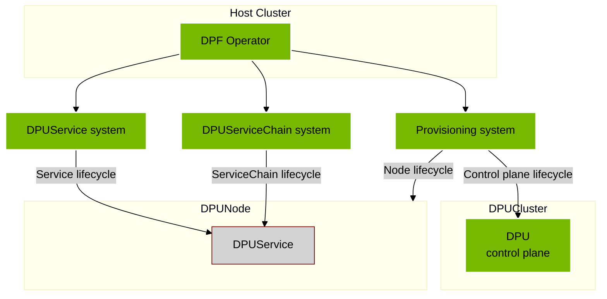
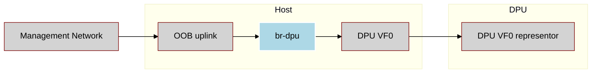
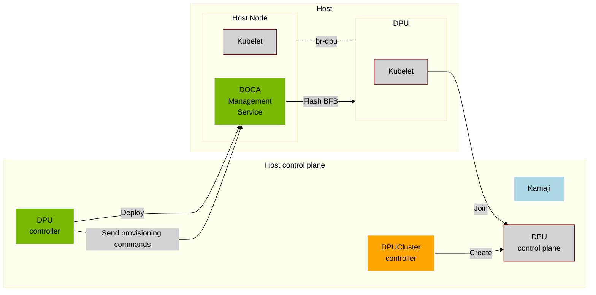
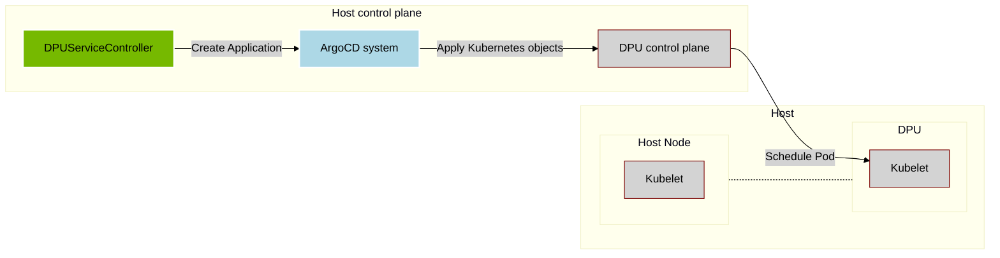
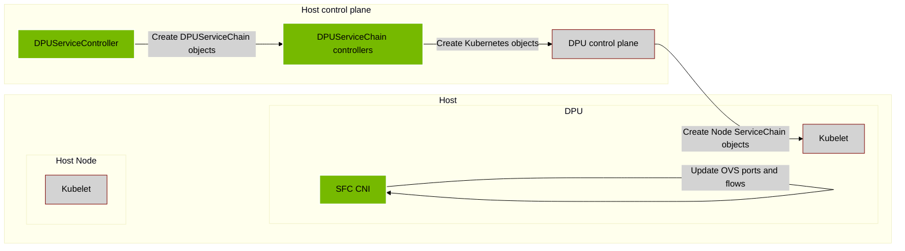

[TOC]

Independent software vendors (ISVs) can integrate DOCA Platform Foundation (DPF). Integration may involve modifying or replacing dependencies and components used in the upstream version of DPF.

The below details the system highlighting which components can be changed in integration.



## DPF Operator

The DPF Operator has a number of dependencies which can be swapped out during integration in favor of solutions managed by the integrator. Replacing some of these components may require additional modification - i.e. certificate management with a tool other than cert manager may require changes to the deployments.

Today the following are either mentioned in the installation guide or installed as dependencies from the DPF Operator helm chart.

* certificate management using `cert-manager`
* storage provisioning using `local-path` provisioner
* NVIDIA Network Operator
* NVIDIA Node maintenance operator

## Host Networking Configuration

DPF relies on each worker node having a specific networking configuration. In this configuration the worker node management interface is plugged into a bridge called `br-dpu`. Virtual functions from the BlueField DPU are added to the same bridge.



This networking pattern must be implemented when integrating DPF. There is no component in DPF which configures this. For more information on the implementation details see the [host networking prerequisites](../../user-guides/host-trusted/prerequisites/host-network-configuration-prerequisite.md).

## Provisioning System

Manage the lifecycle of the DPU hardware and its Kubernetes orchestration system.



The following components are used in upstream DPF and can be modified or replaced during integration:

* DPU Cluster manager- highlighted in orange - can be replaced in full in integration.
* Kamaji controller - a dependency of the DPUCluster manager - can be replaced.
* BF.cfg - a configuration file used when configuring the DPU.

For more information on implementing a DPUCluster manager see [the DPUCluster documentation](../api/dpucluster.md).

### Custom bf.cfg

By default DPF will use a bf.cfg - the Bluefield configuration file - that is tied to the default BFB. If the BFB is replaced during integration it may also be required to replace the bf.cfg.

The DPU controller in the provisioning controller manager uses a template to render the bfb.cfg with values supplied by the user-supplied DPUFlavor. The [default bf.cfg.template for v25.1 is here](https://github.com/NVIDIA/doca-platform/blob/release-v25.1/internal/provisioning/controllers/dpu/bfcfg/bf.cfg.template).
The template takes the form of a go template. The [values used to render it are supplied to it are described in this package](https://github.com/NVIDIA/doca-platform/blob/release-v25.1/internal/provisioning/controllers/dpu/bfcfg/bfcfg.go).

Note: This flow is deprecated in favor of using [dynamic bf.cfg templates](#dynamic-bfcfg-templates)
To supply a custom bf.cfg template:

**1.** Create a `ConfigMap` with the following format in the target cluster:

```yaml
apiVersion: v1
kind: ConfigMap
metadata:
  name: custom-bfb.cfg
  namespace: dpf-operator-system # Must be in the same namespace as the DPFOperator.
data:
    BF_CFG_TEMPLATE: | # This key must be in the ConfigMap.
        {{.KubeadmJoinCMD}}
```

**2.** Configure the provisioning controller to use the custom bf.cfg.template through the DPFOperatorConfig.

```yaml
apiVersion: operator.dpu.nvidia.com/v1alpha1
kind: DPFOperatorConfig
metadata:
  name: dpfoperatorconfig
  namespace: dpf-operator-system
spec:
  provisioningController:
    bfCFGTemplateConfigMap: custom-bfb.cfg
...
```

This example template contains only one variable and misses many important configuration steps. It is not sufficient to provision a DPU in DPF.
To understand how to write a custom bf.cfg.template [the default template](https://github.com/NVIDIA/doca-platform/blob/release-v25.1/internal/provisioning/controllers/dpu/bfcfg/bf.cfg.template) serves as the best example.

#### Dynamic bf.cfg templates

As an alternative to the deprecated `bfCFGTemplateConfigMap` approach, you can use `enableDynamicBFCFGTemplates` for
runtime discovery of bf.cfg templates. When enabled, the provisioning controller discovers ConfigMaps by matching
a label and annotations for the BFB, DPUCluster, and DPUFlavor used during provisioning.

**1.** Create a `ConfigMap` with the required label and annotations:

```yaml
apiVersion: v1
kind: ConfigMap
metadata:
  name: my-bfcfg-template
  namespace: dpf-operator-system # Must be in the same namespace as the DPFOperator.
  labels:
    provisioning.dpu.nvidia.com/bfcfg-template: "true"
  annotations:
    provisioning.dpu.nvidia.com/bfcfg-template-bfb-name: "my-bfb"
    provisioning.dpu.nvidia.com/bfcfg-template-bfb-namespace: "dpf-provisioning"
    provisioning.dpu.nvidia.com/bfcfg-template-cluster-name: "my-cluster"
    provisioning.dpu.nvidia.com/bfcfg-template-cluster-namespace: "dpf-provisioning"
    provisioning.dpu.nvidia.com/bfcfg-template-dpuflavor-name: "my-flavor"
    provisioning.dpu.nvidia.com/bfcfg-template-dpuflavor-namespace: "dpf-provisioning"
data:
  BF_CFG_TEMPLATE: |
    {{.KubeadmSecretName}}
```

Exactly one ConfigMap must match for a given combination of BFB, DPUCluster, and DPUFlavor.

**2.** Enable dynamic templates in the DPFOperatorConfig:

```yaml
apiVersion: operator.dpu.nvidia.com/v1alpha1
kind: DPFOperatorConfig
metadata:
  name: dpfoperatorconfig
  namespace: dpf-operator-system
spec:
  provisioningController:
    enableDynamicBFCFGTemplates: true
...
```

## DPUService System

Orchestrate DOCA Services to run on DPUs.

The following components are used in upstream DPF and can be modified or replaced during integration:

* ArgoCD - a dependency of the DPUService controller manager can be replaced with a managed version of ArgoCD




## DPUServiceChain System
Orchestrate Service Chains for advanced network flows through DPUs.



None of the components used in Service chain orchestration should be replaced during integration.
